# AIM 7-1-10 — Weather Observing Programs

> [!info] Source
> FAA Aeronautical Information Manual, Basic with Change 1, 2 and 3 (effective 2026-07-09) — [view on FAA](https://www.faa.gov/air_traffic/publications/atpubs/aim_html/chap7_section_1.html#7-1-10)

## Official Text

- **a.** Manual Observations. With only a few exceptions, these reports are from airport locations staffed by FAA personnel who manually observe, perform calculations, and enter these observations into the (WMSCR) communication system. The format and coding of these observations are contained in paragraph 7-1-28 , Key to Aviation Routine Weather Report (METAR) and Aerodrome Forecasts (TAF).

- **b.** Automated Weather Observing System (AWOS).

    - **1.** Automated weather reporting systems are increasingly being installed at airports. These systems consist of various sensors, a processor, a computer‐generated voice subsystem, and a transmitter to broadcast local, minute‐by‐minute weather data directly to the pilot.

        > [!note] NOTE-
        > When the barometric pressure exceeds 31.00 inches Hg., see AIM, Para 7-2-3, Altimeter Errors.

    - **2.** The AWOS observations will include the prefix “AUTO” to indicate that the data are derived from an automated system. Some AWOS locations will be augmented by certified observers who will provide weather and obstruction to vision information in the remarks of the report when the reported visibility is less than 7 miles. These sites, along with the hours of augmentation, are to be published in the Chart Supplement. Augmentation is identified in the observation as “OBSERVER WEATHER.” The AWOS wind speed, direction and gusts, temperature, dew point, and altimeter setting are exactly the same as for manual observations. The AWOS will also report density altitude when it exceeds the field elevation by more than 1,000 feet. The reported visibility is derived from a sensor near the touchdown of the primary instrument runway. The visibility sensor output is converted to a visibility value using a 10-minute harmonic average. The reported sky condition/ceiling is derived from the ceilometer located next to the visibility sensor. The AWOS algorithm integrates the last 30 minutes of ceilometer data to derive cloud layers and heights. This output may also differ from the observer sky condition in that the AWOS is totally dependent upon the cloud advection over the sensor site.

    - **3.** These real‐time systems are operationally classified into nine basic levels:

        - **(a)** AWOS-Aonly reports altimeter setting;

            > [!note] NOTE-
            > Any other information is advisory only.

        - **(b)** AWOS-AV reports altimeter and visibility;

            > [!note] NOTE-
            > Any other information is advisory only.

        - **(c)** AWOS-l usually reports altimeter setting, wind data, temperature, dew point, and density altitude;

        - **(d)** AWOS-2 provides the information provided by AWOS-l plus visibility; and

        - **(e)** AWOS-3 provides the information provided by AWOS-2 plus cloud/ceiling data.

        - **(f)** AWOS- 3P provides reports the same as the AWOS 3 system, plus a precipitation identification sensor.

        - **(g)** AWOS- 3PT reports the same as the AWOS 3P System, plus thunderstorm/lightning reporting capability.

        - **(h)** AWOS- 3T reports the same as AWOS 3 system and includes a thunderstorm/lightning reporting capability.

        - **(i)** AWOS- 4 reports the same as the AWOS 3 system, plus precipitation occurrence, type and accumulation, freezing rain, thunderstorm, and runway surface sensors.

    - **4.** The information is transmitted over a discrete VHF radio frequency or the voice portion of a local NAVAID. AWOS transmissions on a discrete VHF radio frequency are engineered to be receivable to a maximum of 25 NM from the AWOS site and a maximum altitude of 10,000 feet AGL. At many locations, AWOS signals may be received on the surface of the airport, but local conditions may limit the maximum AWOS reception distance and/or altitude. The system transmits a 20 to 30 second weather message updated each minute. Pilots should monitor the designated frequency for the automated weather broadcast. A description of the broadcast is contained in subparagraph c. There is no two‐way communication capability. Most AWOS sites also have a dial‐up capability so that the minute‐by‐minute weather messages can be accessed via telephone.

    - **5.** AWOS information (system level, frequency, phone number, etc.) concerning specific locations is published, as the systems become operational, in the Chart Supplement, and where applicable, on published Instrument Approach Procedures. Selected individual systems may be incorporated into nationwide data collection and dissemination networks in the future.

- **c.** AWOS Broadcasts. Computer‐generated voice is used in AWOS to automate the broadcast of the minute‐by‐minute weather observations. In addition, some systems are configured to permit the addition of an operator‐generated voice message; e.g., weather remarks following the automated parameters. The phraseology used generally follows that used for other weather broadcasts. Following are explanations and examples of the exceptions.

    - **1.** Location and Time. The location/name and the phrase “AUTOMATED WEATHER OBSERVATION,” followed by the time are announced.

        - **(a)** If the airport's specific location is included in the airport's name, the airport's name is announced.

            > [!example] EXAMPLE-
            > “Bremerton National Airport automated weather observation, one four five six zulu;”\
            > “Ravenswood Jackson County Airport automated weather observation, one four five six zulu.”

        - **(b)** If the airport's specific location is not included in the airport's name, the location is announced followed by the airport's name.

            > [!example] EXAMPLE-
            > “Sault Ste. Marie, Chippewa County International Airport automated weather observation;”\
            > “Sandusky, Cowley Field automated weather observation.”

        - **(c)** The word “TEST” is added following “OBSERVATION” when the system is not in commissioned status.

            > [!example] EXAMPLE-
            > “Bremerton National Airport automated weather observation test, one four five six zulu.”

        - **(d)** The phrase “TEMPORARILY INOPERATIVE” is added when the system is inoperative.

            > [!example] EXAMPLE-
            > “Bremerton National Airport automated weather observing system temporarily inoperative.”

    - **2.** Visibility.

        - **(a)** The lowest reportable visibility value in AWOS is “less than 1/4.” It is announced as “VISIBILITY LESS THAN ONE QUARTER.”

        - **(b)** A sensor for determining visibility is not included in some AWOS. In these systems, visibility is not announced. “VISIBILITY MISSING” is announced only if the system is configured with a visibility sensor and visibility information is not available.

    - **3.** Weather. In the future, some AWOSs are to be configured to determine the occurrence of precipitation. However, the type and intensity may not always be determined. In these systems, the word “PRECIPITATION” will be announced if precipitation is occurring, but the type and intensity are not determined.

    - **4.** Ceiling and Sky Cover.

        - **(a)** Ceiling is announced as either “CEILING” or “INDEFINITE CEILING.” With the exception of indefinite ceilings, all automated ceiling heights are measured.

            > [!example] EXAMPLE-
            > “Bremerton National Airport automated weather observation, one four five six zulu. Ceiling two thousand overcast;”\
            > “Bremerton National Airport automated weather observation, one four five six zulu. Indefinite ceiling two hundred, sky obscured.”

        - **(b)** The word “Clear” is not used in AWOS due to limitations in the height ranges of the sensors. No clouds detected is announced as “NO CLOUDS BELOW XXX” or, in newer systems as “CLEAR BELOW XXX” (where XXX is the range limit of the sensor).

            > [!example] EXAMPLE-
            > “No clouds below one two thousand.”\
            > “Clear below one two thousand.”

        - **(c)** A sensor for determining ceiling and sky cover is not included in some AWOS. In these systems, ceiling and sky cover are not announced. “SKY CONDITION MISSING” is announced only if the system is configured with a ceilometer and the ceiling and sky cover information is not available.

    - **5.** Remarks. If remarks are included in the observation, the word “REMARKS” is announced following the altimeter setting.

        - **(a)** Automated “Remarks.”

            - **(1)** Density Altitude.

            - **(2)** Variable Visibility.

            - **(3)** Variable Wind Direction.

        - **(b)** Manual Input Remarks. Manual input remarks are prefaced with the phrase “OBSERVER WEATHER.” As a general rule the manual remarks are limited to:

            - **(1)** Type and intensity of precipitation.

            - **(2)** Thunderstorms and direction; and

            - **(3)** Obstructions to vision when the visibility is 3 miles or less.

                > [!example] EXAMPLE-
                > “Remarks ... density altitude, two thousand five hundred ... visibility variable between one and two ... wind direction variable between two four zero and three one zero ...observed weather ... thunderstorm moderate rain showers and fog ... thunderstorm overhead.”

        - **(c)** If an automated parameter is “missing” and no manual input for that parameter is available, the parameter is announced as “MISSING.” For example, a report with the dew point “missing” and no manual input available, would be announced as follows:

            > [!example] EXAMPLE-
            > “Ceiling one thousand overcast ... visibility three ... precipitation ... temperature three zero, dew point missing ... wind calm ... altimeter three zero zero one.”

        - **(d)** “REMARKS” are announced in the following order of priority:

            - **(1)** Automated “REMARKS.”

                - **[a]** Density Altitude.

                - **[b]** Variable Visibility.

                - **[c]** Variable Wind Direction.

            - **(2)** Manual Input “REMARKS.”

                - **[a]** Sky Condition.

                - **[b]** Visibility.

                - **[c]** Weather and Obstructions to Vision.

                - **[d]** Temperature.

                - **[e]** Dew Point.

                - **[f]** Wind; and

                - **[g]** Altimeter Setting.

                    > [!example] EXAMPLE-
                    > “Remarks ... density altitude, two thousand five hundred ... visibility variable between one and two ... wind direction variable between two four zero and three one zero ... observer ceiling estimated two thousand broken ... observer temperature two, dew point minus five.”

- **d.** Automated Surface Observing System (ASOS)/Automated Weather Observing System (AWOS) The ASOS/AWOS is the primary surface weather observing system of the U.S. (See Key to Decode an ASOS/AWOS (METAR) Observation, FIG 7-1-8 and FIG 7-1-9.) The program to install and operate these systems throughout the U.S. is a joint effort of the NWS, the FAA and the Department of Defense. ASOS/AWOS is designed to support aviation operations and weather forecast activities. The ASOS/AWOS will provide continuous minute‐by‐minute observations and perform the basic observing functions necessary to generate an aviation routine weather report (METAR) and other aviation weather information. The information may be transmitted over a discrete VHF radio frequency or the voice portion of a local NAVAID. ASOS/AWOS transmissions on a discrete VHF radio frequency are engineered to be receivable to a maximum of 25 NM from the ASOS/AWOS site and a maximum altitude of 10,000 feet AGL. At many locations, ASOS/AWOS signals may be received on the surface of the airport, but local conditions may limit the maximum reception distance and/or altitude. While the automated system and the human may differ in their methods of data collection and interpretation, both produce an observation quite similar in form and content. For the “objective” elements such as pressure, ambient temperature, dew point temperature, wind, and precipitation accumulation, both the automated system and the observer use a fixed location and time‐averaging technique. The quantitative differences between the observer and the automated observation of these elements are negligible. For the “subjective” elements, however, observers use a fixed time, spatial averaging technique to describe the visual elements (sky condition, visibility and present weather), while the automated systems use a fixed location, time averaging technique. Although this is a fundamental change, the manual and automated techniques yield remarkably similar results within the limits of their respective capabilities.

    - **1.** System Description.

        - **(a)** The ASOS/AWOS at each airport location consists of these main components:

            - **(1)** Individual weather sensors.

            - **(2)** Data collection and processing units.

            - **(3)** Peripherals and displays.

        - **(b)** The ASOS/AWOS sensors perform the basic function of data acquisition. They continuously sample and measure the ambient environment, derive raw sensor data and make them available to the collection and processing units.

    - **2.** Every ASOS/AWOS will contain the following basic set of sensors:

        - **(a)** Cloud height indicator (one or possibly three).

        - **(b)** Visibility sensor (one or possibly three).

        - **(c)** Precipitation identification sensor.

        - **(d)** Freezing rain sensor (at select sites).

        - **(e)** Pressure sensors (two sensors at small airports; three sensors at large airports).

        - **(f)** Ambient temperature/Dew point temperature sensor.

        - **(g)** Anemometer (wind direction and speed sensor).

        - **(h)** Rainfall accumulation sensor.

        - **(i)** Automated Lightning Detection and Reporting System (ALDARS) (excluding Alaska and Pacific Island sites).

    - **3.** The ASOS/AWOS data outlets include:

        - **(a)** Those necessary for on‐site airport users.

        - **(b)** National communications networks.

        - **(c)** Computer‐generated voice (available through FAA radio broadcast to pilots, and dial‐in telephone line).

            > [!note] NOTE-
            > Wind direction is reported relative to magnetic north in ATIS as well as ASOS and AWOS radio (voice) broadcasts.

    - **4.** An ASOS/AWOS report without human intervention will contain only that weather data capable of being reported automatically. The modifier for this METAR report is “AUTO.” When an observer augments or backs-up an ASOS/AWOS site, the “AUTO” modifier disappears.

    - **5.** There are two types of automated stations, AO1 for automated weather reporting stations without a precipitation discriminator, and AO2 for automated stations with a precipitation discriminator. As appropriate, “AO1” and “AO2” must appear in remarks. (A precipitation discriminator can determine the difference between liquid and frozen/freezing precipitation).

        > [!note] NOTE-
        > To decode an ASOS/AWOS report, refer to FIG 7-1-8 and FIG 7-1-9.

        > [!cite] REFERENCE-
        > A complete explanation of METAR terminology is located in AIM, Para 7-1-28, Key to Aerodrome Forecast (TAF) and Aviation Routine Weather Report (METAR).

        **FIG 7-1-10** *Key to Decode an ASOS/AWOS (METAR) Observation (Front)*

        ![[aim0701_AutoC.png|Key to Decode an ASOS/AWOS (METAR) Observation (Front)]]

        **FIG 7-1-10** *Key to Decode an ASOS/AWOS (METAR) Observation (Back)*

        ![[aim0701_AutoB.png|Key to Decode an ASOS/AWOS (METAR) Observation (Back)]]

- **e.** TBL 7-1-5contains a comparison of weather observing programs and the elements reported.

- **f.** Service Standards. During 1995, a government/industry team worked to comprehensively reassess the requirements for surface observations at the nation's airports. That work resulted in agreement on a set of service standards, and the FAA and NWS ASOS sites to which the standards would apply. The term “Service Standards” refers to the level of detail in weather observation. The service standards consist of four different levels of service (A, B, C, and D) as describedbelow. Specific observational elements included in each service level are listed in TBL 7-1-6.

    - **1.** Service Level D defines the minimum acceptable level of service. It is a completely automated service in which the ASOS/AWOS observation will constitute the entire observation, i.e., no additional weather information is added by a human observer. This service is referred to as a stand alone D site.

    - **2.** Service Level C is a service in which the human observer, usually an air traffic controller, augments or adds information to the automated observation. Service Level C also includes backup of ASOS/AWOS elements in the event of an ASOS/AWOS malfunction or an unrepresentative ASOS/AWOS report. In backup, the human observer inserts the correct or missing value for the automated ASOS/AWOS elements. This service is provided by air traffic controllers under the Limited Aviation Weather Reporting Station (LAWRS) process, FSS and NWS observers, and, at selected sites, Non-Federal Observation Program observers.

        Two categories of airports require detail beyond Service Level C in order to enhance air traffic control efficiency and increase system capacity. Services at these airports are typically provided by contract weather observers, NWS observers, and, at some locations, FSS observers.

    - **3.** Service Level B is a service in which weather observations consist of all elements provided under Service Level C, plus augmentation of additional data beyond the capability of the ASOS/AWOS. This category of airports includes smaller hubs or special airports in other ways that have worse than average bad weather operations for thunderstorms and/or freezing/frozen precipitation, and/or that are remote airports.

    - **4.** Service Level A, the highest and most demanding category, includes all the data reported in Service Standard B, plus additional requirements as specified. Service Level A covers major aviation hubs and/or high volume traffic airports with average or worse weather.

        **TBL 7-1-10** *Weather Observing Programs*

        <table>
        <tbody>
        <tr><td>
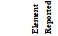
</td><td>
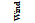
</td><td>

</td><td>
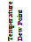
</td><td>
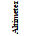
</td><td>
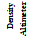
</td><td>
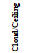
</td><td>
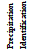
</td><td>
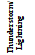
</td><td>
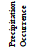
</td><td>
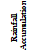
</td><td>
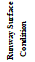
</td><td>
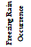
</td><td>
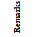
</td></tr>
        <tr><td>
Type
</td><td></td><td></td><td></td><td></td><td></td><td></td><td></td><td></td><td></td><td></td><td></td><td></td><td></td></tr>
        <tr><td>
ASOS
</td><td>
X
</td><td>
X
</td><td>
X
</td><td>
X
</td><td>
X
</td><td>
X
</td><td>
X
</td><td></td><td></td><td>
X
</td><td></td><td>
X
</td><td>
X
</td></tr>
        <tr><td>
AWOS-A
</td><td></td><td></td><td></td><td>
X
</td><td></td><td></td><td></td><td></td><td></td><td></td><td></td><td></td><td></td></tr>
        <tr><td>
AWOS-A/V
</td><td></td><td>
X
</td><td></td><td>
X
</td><td></td><td></td><td></td><td></td><td></td><td></td><td></td><td></td><td></td></tr>
        <tr><td>
AWOS-1
</td><td>
X
</td><td></td><td>
X
</td><td>
X
</td><td>
X
</td><td></td><td></td><td></td><td></td><td></td><td></td><td></td><td></td></tr>
        <tr><td>
AWOS-2
</td><td>
X
</td><td>
X
</td><td>
X
</td><td>
X
</td><td>
X
</td><td></td><td></td><td></td><td></td><td></td><td></td><td></td><td></td></tr>
        <tr><td>
AWOS-3
</td><td>
X
</td><td>
X
</td><td>
X
</td><td>
X
</td><td>
X
</td><td>
X
</td><td></td><td></td><td></td><td></td><td></td><td></td><td></td></tr>
        <tr><td>
AWOS-3P
</td><td>
X
</td><td>
X
</td><td>
X
</td><td>
X
</td><td>
X
</td><td>
X
</td><td>
X
</td><td></td><td></td><td></td><td></td><td></td><td></td></tr>
        <tr><td>
AWOS-3T
</td><td>
X
</td><td>
X
</td><td>
X
</td><td>
X
</td><td>
X
</td><td>
X
</td><td></td><td>
X
</td><td></td><td></td><td></td><td></td><td></td></tr>
        <tr><td>
AWOS-3P/T
</td><td>
X
</td><td>
X
</td><td>
X
</td><td>
X
</td><td>
X
</td><td>
X
</td><td>
X
</td><td>
X
</td><td></td><td></td><td></td><td></td><td></td></tr>
        <tr><td>
AWOS-4
</td><td>
X
</td><td>
X
</td><td>
X
</td><td>
X
</td><td>
X
</td><td>
X
</td><td>
X
</td><td>
X
</td><td>
X
</td><td>
X
</td><td>
X
</td><td>
X
</td><td></td></tr>
        <tr><td>
Manual
</td><td>
X
</td><td>
X
</td><td>
X
</td><td>
X
</td><td></td><td>
X
</td><td>
X
</td><td></td><td></td><td></td><td></td><td></td><td>
X
</td></tr>
        <tr><td colspan="14">
REFERENCE- FAA Order JO 7900.5, Surface Weather Observing, for element reporting.
</td></tr>
        </tbody>
        </table>

        <table>
        <thead>
        <tr><th></th><th colspan="3"></th><th colspan="2">
SERVICE LEVEL A
</th><th></th></tr>
        </thead>
        <tbody>
        <tr><td></td><td colspan="3"></td><td>
Service Level A consists of all the elements of Service Levels B, C and D plus the elements listed to the right, if observed.
</td><td>
10 minute longline RVR at precedented sites or additional visibility increments of 1/8, 1/16 and 0 Sector visibility Variable sky condition Cloud layers above 12,000 feet and cloud types Widespread dust, sand and other obscurations Volcanic eruptions
</td><td></td></tr>
        <tr><td></td><td colspan="2"></td><td colspan="3">
SERVICE LEVEL B
</td><td></td></tr>
        <tr><td></td><td colspan="2"></td><td colspan="2">
Service Level B consists of all the elements of Service Levels C and D plus the elements listed to the right, if observed.
</td><td>
Longline RVR at precedented sites (may be instantaneous readout) Freezing drizzle versus freezing rain Ice pellets Snow depth &amp; snow increasing rapidly remarks Thunderstorm and lightning location remarks Observed significant weather not at the station remarks
</td><td></td></tr>
        <tr><td></td><td></td><td colspan="4">
SERVICE LEVEL C
</td><td></td></tr>
        <tr><td></td><td></td><td colspan="3">
Service Level C consists of all the elements of Service Level D plus augmentation and backup by a human observer or an air traffic control specialist on location nearby. Backup consists of inserting the correct value if the system malfunctions or is unrepresentative. Augmentation consists of adding the elements listed to the right, if observed. During hours that the observing facility is closed, the site reverts to Service Level D.
</td><td>
Thunderstorms Tornadoes Hail Virga Volcanic ash Tower visibility Operationally significant remarks as deemed appropriate by the observer
</td><td></td></tr>
        <tr><td></td><td colspan="5">
SERVICE LEVEL D
</td><td></td></tr>
        <tr><td></td><td colspan="4">
This level of service consists of an ASOS or AWOS continually measuring the atmosphere at a point near the runway. The ASOS or AWOS senses and measures the weather parameters listed to the right.
</td><td>
Wind Visibility Precipitation/Obstruction to vision Cloud height Sky cover Temperature Dew point Altimeter
</td><td></td></tr>
        <tr><td></td><td></td><td></td><td></td><td></td><td></td><td></td></tr>
        </tbody>
        </table>

## Explicit Cross-References

- [[7-1-28|AIM 7-1-28 — Key to Aerodrome Forecast (TAF) and Aviation Routine Weather Report (METAR)]]
- [[7-2-3|AIM 7-2-3 — Altimeter Errors]]

## Glossary Terms

- [[AIR TRAFFIC|AIR TRAFFIC]]
- [[AIR TRAFFIC CONTROL|AIR TRAFFIC CONTROL]]
- [[AIR TRAFFIC CONTROL SPECIALIST|AIR TRAFFIC CONTROL SPECIALIST]]
- [[ALTIMETER SETTING|ALTIMETER SETTING]]
- [[ATIS|ATIS]]
- [[CHART SUPPLEMENT|CHART SUPPLEMENT]]
- [[FIELD ELEVATION|FIELD ELEVATION]]
- [[FSS|FSS]]
- [[INSTRUMENT APPROACH|INSTRUMENT APPROACH]]
- [[INSTRUMENT RUNWAY|INSTRUMENT RUNWAY]]
- [[INTERNATIONAL AIRPORT|INTERNATIONAL AIRPORT]]
- [[NAVAID|NAVAID]]
- [[RUNWAY VISUAL RANGE (RVR)|RUNWAY VISUAL RANGE (RVR)]]
- [[VHF|VHF]]

## Related (derived)

> [!info] Derived links
> Suggested by lexical similarity (`lexical-tfidf` v1), not by an explicit reference. Review in `data/enrichment/related-review.json`.

- [[7-1-29|AIM 7-1-29 — International Civil Aviation Organization (ICAO) Weather Formats]]
- [[4-3-27|AIM 4-3-27 — Operations at Uncontrolled Airports With Automated Surface Observing System (ASOS)/Automated Weather Observing System (AWOS)]]
- [[4-1-13|AIM 4-1-13 — Automatic Terminal Information Service (ATIS)]]
- [[4-1-14|AIM 4-1-14 — Automatic Flight Information Service (AFIS) - Alaska FSSs Only]]
