# Concept Map

> [!note] Curated concept graph
> Study concepts and the order they build on each other, from `data/enrichment/concepts.json`. Every concept links the regulations, AIM paragraphs and glossary terms that define it; nothing here is official text.

## Start here

Concepts with no prerequisites:

- [[How Title 14 Is Organized]]

## By area

### Foundations

- [[How Title 14 Is Organized]]
- [[Regulatory Definitions]]
- [[Pilot in Command Authority]]
- [[Careless and Reckless Flying]]

### Pilot Certification

- [[Pilot Certificates and Ratings]]
- [[Medical Certification]]
- [[Alcohol and Drugs]]
- [[Student Pilot Privileges]]
- [[Private Pilot Eligibility and Privileges]]
- [[Additional Aircraft Endorsements]]
- [[Recent Flight Experience]]
- [[Logbooks and Required Pilot Documents]]
- [[Cross-Country Time]]

### Aircraft

- [[Airworthiness Responsibility]]
- [[Aircraft Documents and Flight Manual]]
- [[Required VFR Equipment]]
- [[Transponders and ADS-B Out]]

### Airspace

- [[Airspace Classification]]
- [[Operating in Controlled Airspace]]
- [[Special Use and Other Airspace]]
- [[National Security Airspace and ADIZ]]

### Weather and Flight Rules

- [[VFR Visibility and Cloud Clearance]]
- [[Special VFR]]
- [[Minimum Safe and VFR Cruising Altitudes]]
- [[Right-of-Way Rules]]
- [[Night Operations]]
- [[Aviation Weather Services]]
- [[Thunderstorms Icing and Wind Shear]]

### Air Traffic Control

- [[ATC Communications]]
- [[ATC Facilities and Services for VFR Aircraft]]
- [[ATC Clearances and Instructions]]

### Airport Operations

- [[Airport Markings Signs and Lighting]]
- [[Towered and Non-Towered Airports]]
- [[Traffic Pattern Procedures]]
- [[Taxiing and Runway Incursion Avoidance]]
- [[Wake Turbulence Avoidance]]

### Flight Planning

- [[Preflight Action and VFR Fuel]]
- [[NOTAMs]]
- [[VFR Flight Plans]]
- [[Passengers and Safety Belts]]

### Human Factors

- [[Aeromedical Factors]]
- [[Collision Avoidance]]
- [[VFR Flight Hazards]]

### Emergencies

- [[Emergencies and Deviations]]
- [[Emergency Locator Transmitters and Search and Rescue]]
- [[Accident and Incident Reporting]]

## Suggested order

Prerequisites always come first; otherwise alphabetical:

1. [[How Title 14 Is Organized]]
2. [[Regulatory Definitions]]
3. [[Aeromedical Factors]]
4. [[Airport Markings Signs and Lighting]]
5. [[Airspace Classification]]
6. [[ATC Communications]]
7. [[ATC Clearances and Instructions]]
8. [[ATC Facilities and Services for VFR Aircraft]]
9. [[Aviation Weather Services]]
10. [[NOTAMs]]
11. [[Pilot Certificates and Ratings]]
12. [[Additional Aircraft Endorsements]]
13. [[Logbooks and Required Pilot Documents]]
14. [[Medical Certification]]
15. [[Alcohol and Drugs]]
16. [[Pilot in Command Authority]]
17. [[Airworthiness Responsibility]]
18. [[Aircraft Documents and Flight Manual]]
19. [[Careless and Reckless Flying]]
20. [[Emergencies and Deviations]]
21. [[Accident and Incident Reporting]]
22. [[Minimum Safe and VFR Cruising Altitudes]]
23. [[Preflight Action and VFR Fuel]]
24. [[Recent Flight Experience]]
25. [[Required VFR Equipment]]
26. [[Night Operations]]
27. [[Right-of-Way Rules]]
28. [[Collision Avoidance]]
29. [[Special Use and Other Airspace]]
30. [[National Security Airspace and ADIZ]]
31. [[Student Pilot Privileges]]
32. [[Cross-Country Time]]
33. [[Private Pilot Eligibility and Privileges]]
34. [[Passengers and Safety Belts]]
35. [[Taxiing and Runway Incursion Avoidance]]
36. [[Thunderstorms Icing and Wind Shear]]
37. [[Towered and Non-Towered Airports]]
38. [[Traffic Pattern Procedures]]
39. [[Transponders and ADS-B Out]]
40. [[Operating in Controlled Airspace]]
41. [[VFR Flight Hazards]]
42. [[VFR Flight Plans]]
43. [[Emergency Locator Transmitters and Search and Rescue]]
44. [[VFR Visibility and Cloud Clearance]]
45. [[Special VFR]]
46. [[Wake Turbulence Avoidance]]

## Prerequisite diagram

```mermaid
graph TD
  c_title_14_structure["How Title 14 Is Organized"]
  c_definitions["Regulatory Definitions"]
  c_pilot_in_command["Pilot in Command Authority"]
  c_careless_operation["Careless and Reckless Flying"]
  c_pilot_certificates["Pilot Certificates and Ratings"]
  c_medical_certification["Medical Certification"]
  c_alcohol_and_drugs["Alcohol and Drugs"]
  c_student_pilot["Student Pilot Privileges"]
  c_private_pilot_certificate["Private Pilot Eligibility and Privileges"]
  c_additional_endorsements["Additional Aircraft Endorsements"]
  c_recent_experience["Recent Flight Experience"]
  c_logbooks["Logbooks and Required Pilot Documents"]
  c_cross_country["Cross-Country Time"]
  c_airworthiness["Airworthiness Responsibility"]
  c_aircraft_documents["Aircraft Documents and Flight Manual"]
  c_required_equipment["Required VFR Equipment"]
  c_transponder_and_adsb["Transponders and ADS-B Out"]
  c_airspace_classification["Airspace Classification"]
  c_controlled_airspace_operations["Operating in Controlled Airspace"]
  c_special_use_airspace["Special Use and Other Airspace"]
  c_national_security_airspace["National Security Airspace and ADIZ"]
  c_vfr_weather_minimums["VFR Visibility and Cloud Clearance"]
  c_special_vfr["Special VFR"]
  c_altitudes["Minimum Safe and VFR Cruising Altitudes"]
  c_right_of_way["Right-of-Way Rules"]
  c_night_operations["Night Operations"]
  c_weather_services["Aviation Weather Services"]
  c_hazardous_weather["Thunderstorms Icing and Wind Shear"]
  c_atc_communications["ATC Communications"]
  c_atc_services["ATC Facilities and Services for VFR Aircraft"]
  c_clearances["ATC Clearances and Instructions"]
  c_airport_markings["Airport Markings Signs and Lighting"]
  c_airport_operations["Towered and Non-Towered Airports"]
  c_traffic_patterns["Traffic Pattern Procedures"]
  c_runway_safety["Taxiing and Runway Incursion Avoidance"]
  c_wake_turbulence["Wake Turbulence Avoidance"]
  c_preflight_action["Preflight Action and VFR Fuel"]
  c_notams["NOTAMs"]
  c_vfr_flight_plans["VFR Flight Plans"]
  c_passengers_and_belts["Passengers and Safety Belts"]
  c_aeromedical_factors["Aeromedical Factors"]
  c_collision_avoidance["Collision Avoidance"]
  c_flight_hazards["VFR Flight Hazards"]
  c_emergencies["Emergencies and Deviations"]
  c_search_and_rescue["Emergency Locator Transmitters and Search and Rescue"]
  c_accident_reporting["Accident and Incident Reporting"]
  c_title_14_structure --> c_definitions
  c_definitions --> c_pilot_in_command
  c_pilot_in_command --> c_careless_operation
  c_definitions --> c_pilot_certificates
  c_pilot_certificates --> c_medical_certification
  c_medical_certification --> c_alcohol_and_drugs
  c_pilot_certificates --> c_student_pilot
  c_medical_certification --> c_student_pilot
  c_student_pilot --> c_private_pilot_certificate
  c_pilot_certificates --> c_additional_endorsements
  c_pilot_certificates --> c_recent_experience
  c_pilot_certificates --> c_logbooks
  c_definitions --> c_cross_country
  c_student_pilot --> c_cross_country
  c_pilot_in_command --> c_airworthiness
  c_airworthiness --> c_aircraft_documents
  c_airworthiness --> c_required_equipment
  c_required_equipment --> c_transponder_and_adsb
  c_definitions --> c_airspace_classification
  c_airspace_classification --> c_controlled_airspace_operations
  c_atc_communications --> c_controlled_airspace_operations
  c_transponder_and_adsb --> c_controlled_airspace_operations
  c_airspace_classification --> c_special_use_airspace
  c_special_use_airspace --> c_national_security_airspace
  c_airspace_classification --> c_vfr_weather_minimums
  c_vfr_weather_minimums --> c_special_vfr
  c_controlled_airspace_operations --> c_special_vfr
  c_pilot_in_command --> c_altitudes
  c_pilot_in_command --> c_right_of_way
  c_required_equipment --> c_night_operations
  c_recent_experience --> c_night_operations
  c_definitions --> c_weather_services
  c_weather_services --> c_hazardous_weather
  c_definitions --> c_atc_communications
  c_atc_communications --> c_atc_services
  c_atc_communications --> c_clearances
  c_definitions --> c_airport_markings
  c_right_of_way --> c_airport_operations
  c_atc_communications --> c_airport_operations
  c_airport_markings --> c_airport_operations
  c_airport_operations --> c_traffic_patterns
  c_airport_markings --> c_runway_safety
  c_atc_communications --> c_runway_safety
  c_airport_operations --> c_wake_turbulence
  c_pilot_in_command --> c_preflight_action
  c_weather_services --> c_preflight_action
  c_notams --> c_preflight_action
  c_definitions --> c_notams
  c_preflight_action --> c_vfr_flight_plans
  c_atc_services --> c_vfr_flight_plans
  c_private_pilot_certificate --> c_passengers_and_belts
  c_definitions --> c_aeromedical_factors
  c_right_of_way --> c_collision_avoidance
  c_aeromedical_factors --> c_collision_avoidance
  c_preflight_action --> c_flight_hazards
  c_pilot_in_command --> c_emergencies
  c_atc_communications --> c_emergencies
  c_emergencies --> c_search_and_rescue
  c_vfr_flight_plans --> c_search_and_rescue
  c_emergencies --> c_accident_reporting
```

